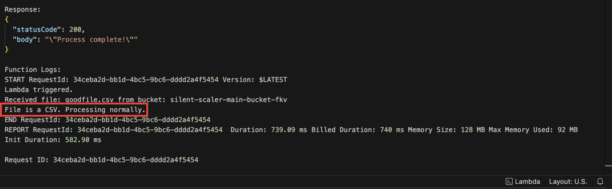
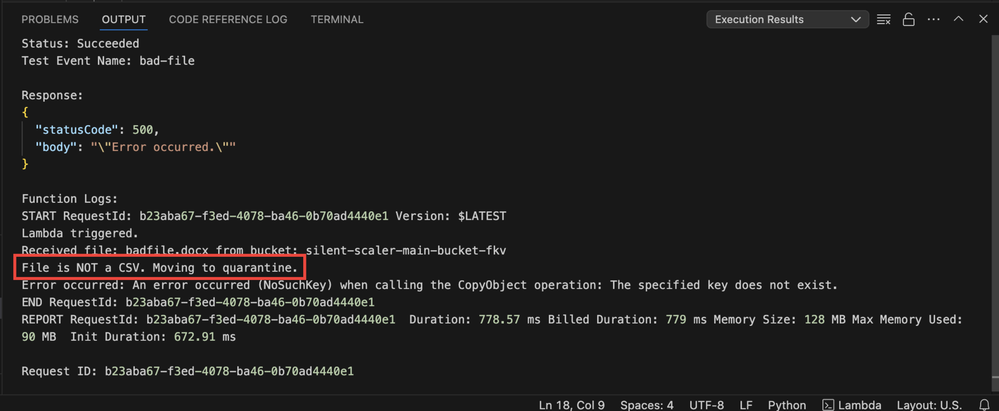
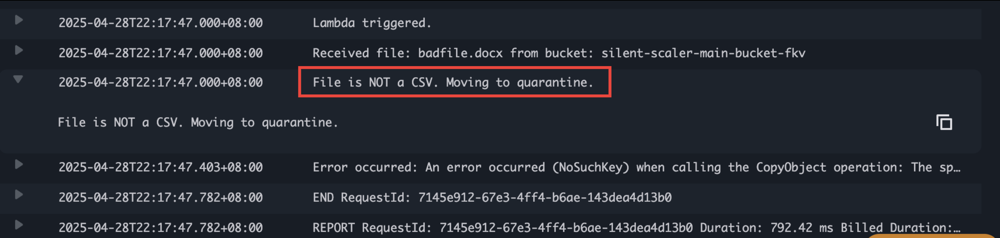

# Silent Scaler — Serverless Data Pipeline


Silent Scaler is a fully serverless, infrastructure-as-code data pipeline built entirely with AWS and Terraform. This project automates file validation, storage, quarantine of invalid files, and real-time error notifications via SNS, demonstrating modular design, scalability, and operational resilience.

---

## Demo

🎥 **Watch the full demo on YouTube**  
_(Placeholder — upload demo video and replace this link)_

[Watch the YouTube demo](https://your-link-here.com)

> 📃 **Note:** This service is currently turned off to reduce AWS costs, but all resources can be reproduced from this repository.

---

## Architecture

This diagram summarizes the AWS serverless architecture of Silent Scaler:


- Files uploaded to **S3 Main Bucket**.
- **Lambda Function** validates files.
  - Good files -> Metadata saved to **DynamoDB**.
  - Bad files -> Moved to **Quarantine Bucket**.
  - Errors trigger **SNS Notifications**.
- **CloudWatch Logs** for monitoring Lambda behavior.

---

## Technologies Used

- **AWS S3**: File storage and event triggers.
- **AWS Lambda**: Serverless file validation and quarantine handler.
- **AWS DynamoDB**: Metadata storage.
- **AWS SNS**: Real-time error notifications.
- **AWS CloudWatch**: Monitoring and error tracking.
- **Terraform**: Infrastructure as code (IaC) deployment.

---

## Project Setup

1. Clone the repo:
```bash
git clone https://github.com/fkv747/terraform-silent-scaler.git
cd terraform-silent-scaler
```

2. Initialize Terraform:
```bash
terraform init
```

3. Plan the deployment:
```bash
terraform plan
```

4. Apply the infrastructure:
```bash
terraform apply
```

---

## Folder Structure


---

## Module Breakdown

| Module | Purpose |
|:---|:---|
| **S3 Bucket** | Main upload bucket + quarantine bucket creation |
| **Lambda Function** | Processes uploaded files, validates CSV format, handles quarantine |
| **DynamoDB Table** | Stores file metadata for valid uploads |
| **SNS Topic** | Sends notifications on critical errors |
| **CloudWatch** | Logs Lambda activities and failures |

---

## Terraform Apply Screenshots

**Deploying S3 Buckets:**


**Deploying DynamoDB Table:**


**Deploying Lambda Function:**


**Deploying SNS Topic:**


**Deploying S3 Trigger Notification:**


**Lambda Handler Deployment Update:**


**Final Lambda Deployment:**


---

## Testing & Validation

**Lambda Test - Good File (CSV)**



**Lambda Test - Bad File (Non-CSV)**



**CloudWatch Logs - Good File Processing**


**CloudWatch Logs - Bad File Processing**



---

## Challenges Faced & Lessons Learned

Building Silent Scaler was not without obstacles. Here are some real-world issues faced during development:

**1. Environment Variables Missing**


- Missing environment variable `QUARANTINE_BUCKET` caused Lambda failures.
- Lesson: Always validate environment variable injection into Lambda functions during deployment.

**2. IAM Permissions Errors**


- Lambda initially lacked permission to publish to SNS.
- Lesson: Ensuring correct IAM Role permissions is critical for event-driven pipelines.

**3. SNS Publishing Authorization Error**


- AccessDenied when trying to publish SNS notifications.
- Lesson: Explicitly attach SNS publish policies to Lambda execution roles.

> **Key Takeaway:** Real-world AWS projects require frequent debugging, permission tuning, and error handling mastery.

---

## Future Improvements

- Add **API Gateway** endpoint for direct upload from external users.
- Enhance quarantine logic to auto-tag bad files.
- Implement retry mechanisms for failed SNS publishing.

---


## Connect with Me

📫 [LinkedIn](https://www.linkedin.com/in/franc-kevin-v-07108b111/)